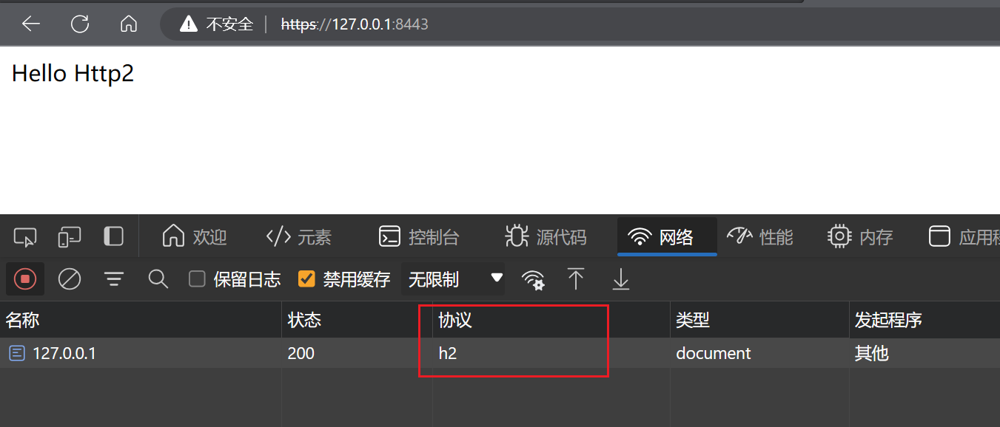

# 使用http2

> 许多浏览器，包括Edge，仅在TLS（即HTTPS）情况下支持HTTP/2。即使服务器端配置为无TLS支持的HTTP/2，浏览器可能仍将回退到HTTP/1.1。所以我们需要有一个证书来开启https。

## 生成自签名证书

使用JDK的`keytool`工具生成自签名证书。

另外还可以使用[mkcert](https://github.com/FiloSottile/mkcert)工具生成本地可信的证书。

```bash
keytool -genkeypair -alias myalias -keyalg RSA -keysize 2048 -storetype PKCS12 -keystore keystore.p12 -validity 3650
```
`-genkeypair` 表示生成一对公私钥。

`-alias myalias` 是你给密钥指定的别名。

`-keyalg RSA` 指定密钥算法，RSA是最常用的。

`-keysize 2048` 指定密钥大小。

`-storetype PKCS12` 指定密钥库类型，PKCS12是推荐的类型。

`-keystore keystore.p12` 是新密钥库的文件名。

`-validity 3650` 指定证书的有效期，这里是10年。

这个命令会创建一个有效期为10年的自签名证书。你会被提示输入证书的详细信息，如你的姓名和组织。最重要的是，它会要求你设置一个密钥库密码，你需要记住这个密码，因为配置Spring Boot时会用到。

```bash
~\http2\src\main\resources>keytool -genkeypair -alias myalias -keyalg RSA -keysize 2048 -storetype PKCS12 -keystore keystore.p12 -validity 3650
输入密钥库口令:  
再次输入新口令: 
您的名字与姓氏是什么?
  [Unknown]:  www.xingchen.com
您的组织单位名称是什么?
  [Unknown]:  IT Department
您的组织名称是什么?
  [Unknown]:  Xingchen Technology Co., Ltd.
您所在的城市或区域名称是什么?
  [Unknown]:  Beijing
您所在的省/市/自治区名称是什么?
  [Unknown]:  Beijing
该单位的双字母国家/地区代码是什么?
  [Unknown]:  CN
CN=www.xingchen.com, OU=IT Department, O="Xingchen Technology Co., Ltd.", L=Beijing, ST=Beijing, C=CN是否正确?
  [否]:  y

正在为以下对象生成 2,048 位RSA密钥对和自签名证书 (SHA256withRSA) (有效期为 3,650 天):
         CN=www.xingchen.com, OU=IT Department, O="Xingchen Technology Co., Ltd.", L=Beijing, ST=Beijing, C=CN
```

## 配置

创建了证书后，将其放在Spring Boot项目的资源目录下，例如src/main/resources。

然后，在你的application.yml配置文件中添加SSL和HTTP/2的配置：

application.yml
```yml
server:
  port: 8443  # HTTPS服务监听的端口号，默认为443，这里使用了8443，避免与系统端口冲突
  ssl:
    key-store: classpath:keystore.p12 # 指向包含服务器私钥和证书的密钥库文件
    key-store-password: 123456  # 密钥库的密码
    key-store-type: PKCS12  # 密钥库类型，PKCS12是一种广泛支持的格式
    key-alias: myalias  # 密钥库中密钥的别名
  http2:
    enabled: true # 启用HTTP/2协议，确保使用的服务器支持HTTP/2
```

## 测试

在浏览器访问 https://127.0.0.1:8443/ ，打开开发者工具可以看到发起的请求，把协议栏打开可以看到使用的是HTTP/2（h2）。

