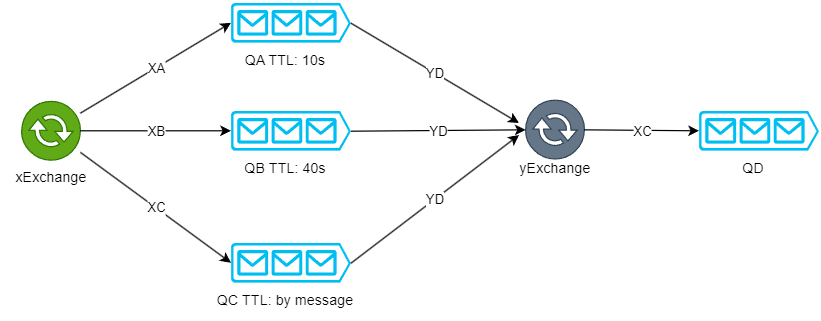
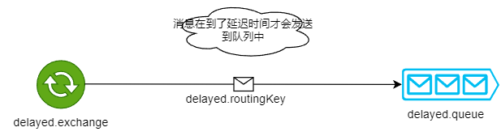
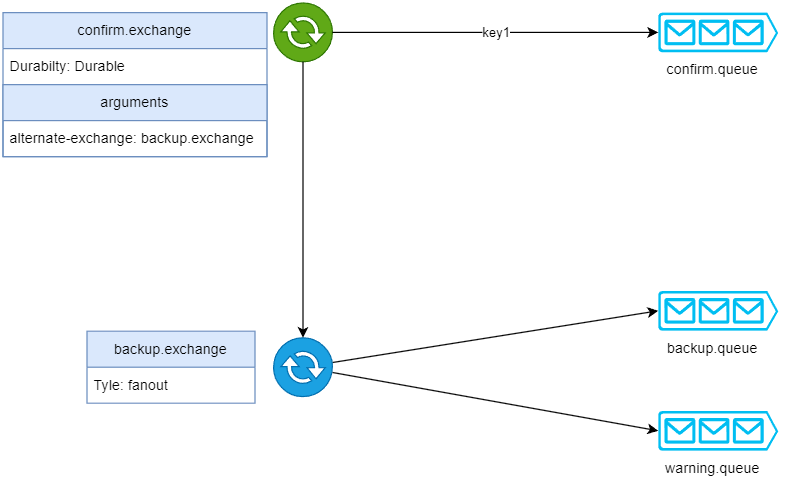
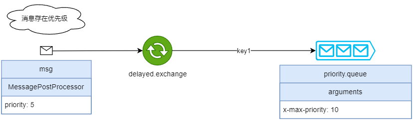

# TTL队列

博客：[RabbitMQ消息的生存时间TTL（Time To Live）](https://www.cnblogs.com/zjw-blog/p/17957279)

# 延迟队列

博客：[RabbitMQ延迟队列](https://www.cnblogs.com/zjw-blog/p/17959220)

# 发布确认及备份交换机

博客：[RabbitMQ队列和消息的优先级](https://www.cnblogs.com/zjw-blog/p/17959278)

# 队列和消息的优先级

博客：[RabbitMQ队列和消息的优先级](https://www.cnblogs.com/zjw-blog/p/17959306)

